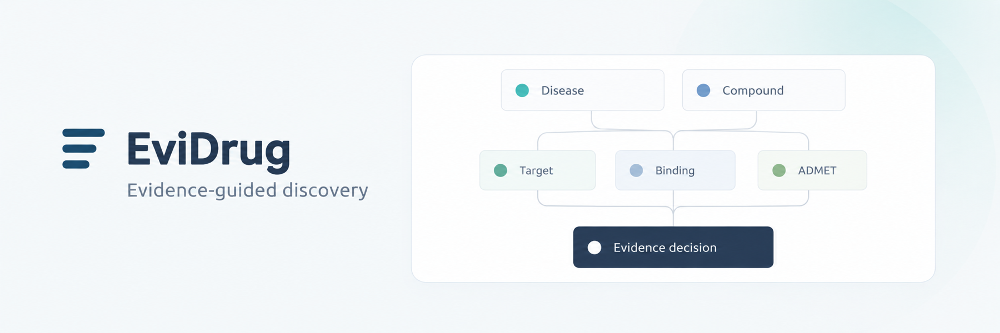
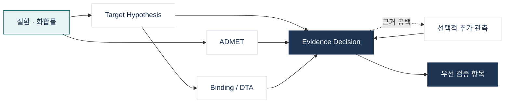

<p align="center">
  
</p>

<p align="center">
  초기 신약 후보의 흩어진 근거를 연결하고, 불확실성을 보존한 채 다음 검증의 우선순위를 제안하는<br />
  <strong>evidence-aware multi-agent decision support system</strong>
</p>

<p align="center">
  <a href="https://evidrug.kr">서비스</a> ·
  <a href="docs/local-setup.md">로컬 실행</a> ·
  <a href="docs/project-status.md">구현 현황</a> ·
  <a href="docs/README.md">문서</a>
</p>

## 왜 EviDrug인가요?

초기 후보를 검토할 때 질환 연관성, 표적 타당성, 결합 가능성, 약동학과 독성 신호는 서로 다른
데이터와 모델에 흩어져 있습니다. EviDrug는 이들을 하나의 점수로 뭉개지 않습니다. 전문 Agent가
각 관점을 독립적으로 검토하고, 출처가 남은 관측과 해석을 연결해 **지지 근거, 충돌, 데이터 공백,
다음 실험**을 함께 제시합니다.

- 질환과 화합물에서 검토 가능한 분석 대상을 구성합니다.
- 표적의 질환 연관성·인과 근거와 단백질 identity를 확인합니다.
- 서로 다른 DTA 모델 결과와 공개 assay 근거를 분리해 보존합니다.
- ADMET 및 선택적 심장 이온통로 신호를 임상적 결론과 구분해 해석합니다.
- 실행 이력과 원 관측을 저장해 결과를 다시 열고 근거를 추적할 수 있습니다.

> EviDrug는 연구 우선순위 결정을 지원합니다. 임상 판단, 치료 권고 또는 후보의 안전성·효능
> 확정을 대신하지 않습니다.

## 분석 흐름



Target과 ADMET은 독립적으로 시작합니다. DTA는 검증된 표적 서열을 사용하고, Decision은 저장된
전문 결과의 작은 projection만 종합합니다. 추가 관측은 무조건 실행하지 않고 근거 공백과 허용된
도구가 일치할 때만 요청합니다. 부분 실패는 성공처럼 숨기지 않고 결과 상태에 보존합니다.

## 지원 도구와 데이터 소스

아래 목록은 현재 코드에 연결된 provider와 고정 tool binding을 기준으로 합니다. “지원”은 해당
도구가 답할 수 있는 좁은 evidence question을 뜻하며, 과학적 정확도나 임상 유효성 보증을 뜻하지
않습니다.

| 영역 | 도구·데이터 소스 | EviDrug에서의 역할 | 실행 방식 |
| :--- | :--- | :--- | :--- |
| 질환·표적 | Open Targets GraphQL | 질환 후보 확인, 질환–표적 연관·인과 근거 수집 | 외부 API |
| 표적 identity | UniProtKB/Swiss-Prot | reviewed human protein과 서열 계약 검증 | 외부 API |
| 표적 성숙도 | Pharos / IDG | TDL, ligand·publication 지식량을 별도 관측 | 외부 API |
| ADMET | ADMET-AI 1.4.0 | endpoint 예측과 DrugBank approved reference percentile | 로컬 고정 모델 |
| 결합 예측 | DeepPurpose 0.1.5 | CNN–CNN 및 MPNN–CNN BindingDB 모델별 DTA 점수 | 로컬 고정 모델 |
| 실험 결합 근거 | PubChem BioAssay | 동일 compound–target의 공개 assay 기록 조회 | 선택적 외부 API |
| 심장 안전성 신호 | CToxPred2 RF-SSL | hERG, Nav1.5, Cav1.2 liability 추가 관측 | 선택적 로컬 모델 |
| 근거 해석 | Dacon-compatible LLM gateway | 전문 결과 구조화와 근거 기반 Decision 생성 | 외부 API |

도구는 `ToolRegistry → admission → runner → repository` 경계를 통과합니다. Agent별 허용 범위,
입력 schema, timeout, 모델·provider version과 실행 결과를 고정하고, 실패한 관측을 정상 점수로
대체하는 숨은 fallback은 두지 않습니다. CToxPred2와 PubChem BioAssay는 전체 PoC profile에서
활성화할 수 있으며 실제 호출은 입력과 근거 공백에 따라 달라집니다.

## 결과에서 확인할 수 있는 것

| 관점 | 주요 결과 |
| :--- | :--- |
| Target Hypothesis | 후보 표적, 질환 근거, 인과성 경계, UniProt identity, shortlist |
| ADMET | 원 endpoint 관측, 선택 범위, ADME·독성 해석, 누락 및 실패 상태 |
| Binding / DTA | 모델별 score type·단위·provenance, 후보별 실행 결과, 공개 assay 근거 |
| Evidence Decision | 강점, 위험, 상충, 근거 공백, 조건부 판단과 다음 검증 항목 |
| Trace | Agent/tool 실행 상태, version, 사용량, 원 관측 참조와 재조회 가능한 결과 |

## 빠른 시작

Docker Desktop 또는 Docker Engine과 Compose v2가 필요합니다.

```sh
git clone https://github.com/truthfree/EviDrug.git
cd EviDrug
cp .env.example .env
python3 scripts/doctor.py
docker compose up --build
```

- Web: `http://localhost:5173`
- API: `http://localhost:8000`
- OpenAPI: `http://localhost:8000/api/v1/docs`
- Health: `http://localhost:8000/api/v1/health`

기본 Compose는 웹/API/PostgreSQL/Redis와 가벼운 worker를 실행합니다. 로그인에는 접근 코드 hash와
세션 secret이 필요하고, 실제 ADMET·DTA·Decision 전체 분석에는 별도 API key와 모델 이미지가
필요합니다. 전체 요구사항과 안전한 설정 방법은 [로컬 실행 안내](docs/local-setup.md)를 먼저
확인하세요.

```sh
python3 scripts/doctor.py --full
bash scripts/build-poc.sh
docker compose -f compose.yaml -f compose.poc.yaml up -d --build
```

현재 LLM 연결은 일반 OpenAI endpoint가 아니라 Dacon gateway의 endpoint·header·허용 모델 계약을
사용합니다. Apple Silicon에서는 전체 worker가 `linux/amd64` 에뮬레이션으로 실행되어 최초 빌드와
추론이 더 오래 걸릴 수 있습니다.

## 기술 구성

```text
React · TypeScript · Vite
             │
        FastAPI API
             │
   PostgreSQL ├─ Redis / Celery
             │
     versioned Agent + Tool runtime
```

Backend는 Python 3.12, FastAPI, Pydantic, SQLAlchemy와 Alembic을 사용합니다. Frontend는 React 19,
TypeScript와 Vite로 구성되어 있습니다. 분석은 Celery worker에서 실행되고 PostgreSQL에 상태와
결과를, Redis에 작업 전달 상태를 둡니다. 정확한 dependency version은 `backend/uv.lock`과
`frontend/package-lock.json`이 기준입니다.

## 현재 상태

전체 분석 실행, 단계별 상태 저장, 부분 실패 보존, 최근 결과 목록과 결과 재열기까지 연결되어
있습니다. 다만 단일 실행 성공은 과학적 정확도 검증이 아닙니다. 현재는 구조화 Decision의 반복
안정성과 사람 기준 품질 평가, 다양한 후보에 대한 모델 적용 범위를 계속 검증하고 있습니다.

- [현재 구현과 검증 근거](docs/project-status.md)
- [개발자 안내](docs/development.md)
- [기능·아키텍처 문서](docs/README.md)
- [현재 UX와 사용 흐름](docs/ux/current-experience.md)
- [제3자 모델·데이터 고지](THIRD_PARTY_NOTICES.md)
- [PoC 전체 실행 계약](docs/features/poc-full-execution.md)

## 연구 사용 고지

모델 예측과 공개 데이터는 범위, 시점, 학습 데이터와 입력 품질의 영향을 받습니다. 서로 다른
score type이나 단위를 직접 평균하지 않으며, 데이터베이스에 기록이 없다는 사실을 생물학적 부재로
해석하지 않습니다. 모든 출력은 원문 근거와 전문 검토를 거쳐 사용해야 합니다.

## 라이선스

EviDrug가 직접 작성한 코드는 [MIT License](LICENSE)로 배포합니다. 사용한 모델, 가중치,
라이브러리와 외부 데이터에는 각 제공자의 별도 조건이 적용됩니다. 자세한 내용은
[제3자 모델·데이터 고지](THIRD_PARTY_NOTICES.md)를 확인하세요.
