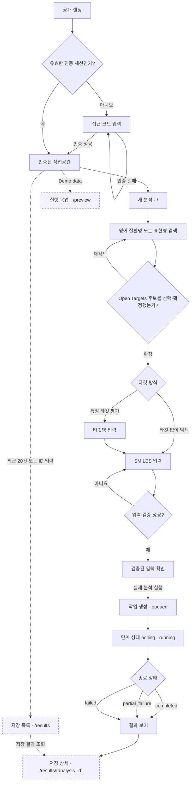

# 현재 사용자 경험

기준일: **2026-09-29**, 저장소의 현재 프론트엔드 경로·상태 전이와 사용자의 첫 배포 확인 기준이다.
[프로젝트 현황](../project-status.md)은 구현·검증 범위를 설명한다.

## 1. 실제 분석과 저장 결과 흐름

1. 공개 화면에서 접근 코드로 인증한다.
2. 질환을 검색해 후보를 확정하고, 표적 탐색/지정과 SMILES 검증을 진행한다.
3. 확인한 입력으로 실제 분석을 생성한다. 입력 검증과 분석 실행(토큰·도구 자원 사용)은 별도 행동이다.
4. 단계별 상태, Target 결과, ADMET·DTA·Decision 결과를 읽는다.
5. 저장 결과 목록에서 같은 분석의 상세 화면을 다시 연다.

### 1.1 현재 구현 기준 사용자 흐름

아래 그림은 목표안이 아니라 현재 프론트엔드의 경로와 상태 전이를 나타낸다.
점선은 실제 분석을 만들지 않는 조회·목업 경로다.

입력 검증은 canonical SMILES를 확인하지만 분석 작업을 생성하지 않는다. `실제 분석 실행`을
눌러야 새 작업과 모델·도구 사용이 시작된다. 종료 뒤 `결과 보기`와 저장 목록의 상세 조회는
같은 `/results/{analysis_id}`를 사용하며 기존 저장 결과만 읽는다.

| 화면 | 경로와 동작 | 모델·LLM 호출 |
| :--- | :--- | :--- |
| 새 분석 | `/`: 입력·실행·진행 상태 | 새 분석 생성 시 발생 |
| 실행 목업 | `/preview`: Demo data | 없음 |
| 저장 목록 | `/results`: 최근 20건 요약, 수동 ID 조회 | 없음 |
| 저장 상세 | `/results/{analysis_id}`: ADMET·DTA·Decision 저장 결과 | 없음 |

화면 이동 중 진행 상태는 유지하지만 새로고침 후 입력·실행 UI 전체 자동 복원까지
보장하는 것은 아니다. 상세 URL을 다시 여는 것은 저장 결과 조회이며 분석 재실행이 아니다.
현재 상세 loader는 전문 결과 API를 사용하며 Target 카드 전체의 복원 경로와 구분한다.

## 2. 결과를 읽는 기준

- `completed`는 실행 계약을 만족한 상태다. 과학적 정확도·약효의 검증 결과는 아니다.
- `partial_failure`는 일부 단계·해석이 실패해도 사용 가능한 결과를 보존한다.
  과학적 근거 공백은 정상 완료 결과에도 남을 수 있으며 실행 실패와 구분한다.
- `failed`여도 앞 단계에 저장한 관측이 있을 수 있다.
- 진행률 100%는 종료 상태 표시이며 모든 단계의 성공률이나 남은 시간 예측이 아니다.

| 결과 | 현재 표시의 핵심 | 해석 시 구분 |
| :--- | :--- | :--- |
| Target | 표적 후보·연관성·접근성·인과 근거·방향 | 연관성 점수와 실험적 약효 |
| ADMET | ADME 12개·독성 4개 고정 선택과 영역별 해석 | 의도된 일부 항목 선택, 결측, 실행 실패 |
| DTA | 두 모델의 pKd·실행 상태·해석 | 모델 간 차이, 실험적 결합, 억제·약효 |
| Decision | 연구 우선순위·이유·상충·추가 검증 | 현재 근거의 판단과 임상적 결론 |

도구의 예측 성공과 LLM 해석 실패는 따로 읽는다. 두 DTA 예측을 평균해 대표값을 만들지
않으며 ADMET percentile을 안전성 확률로 읽지 않는다. 표시된 토큰은 원 실행의 사용량이고
재조회 비용이 아니다. 사용량 정보가 없다는 표시를 0토큰으로 해석하지 않는다.

## 3. 기록 접근 범위

현재 인증 세션 또는 유효한 동일 브라우저 ID로 자신의 일반 분석에 접근한다.
같은 브라우저에서 로그아웃·재로그인해도 브라우저 쿠키가 유지되면 기록을 조회할 수 있다.
같은 접근 코드만 입력한 다른 브라우저가 해당 기록의 소유권을 얻는 것은 아니다.

쿠키 삭제·만료·서명 비밀값 교체나 과거 세션 전용 기록에는 복구 제한이 있다.
개인 계정이나 다중 기기 기록 동기화는 없다. 목록·상세는 유효한 인증을 요구하고
개발 CLI replay 분석은 웹 공개 대상에서 제외한다.
세부 계약은 [브라우저별 기록](../features/browser-analysis-history.md)을 따른다.

## 4. 아직 없는 기능과 검증 경계

결과 공유 권한, PDF 보고서, 브라우저 완료 알림, 사용자 replay UI, 동일 입력 자동 캐시,
분자 구조 그림과 범용 자연어 질환 해석은 현재 제공 기능으로 안내하지 않는다.
상세 URL이 있다는 사실만으로 다른 사용자에게 공개 공유할 수 있다는 뜻은 아니다.

사용자 제공 배포 기록에서 새 전체 분석 completed와 저장 결과 재열기가 확인됐다.
최신 UI의 모바일·키보드·세션 만료·부분 실패·조회 오류 전체를 이번 문서 작업에서
실브라우저 검증한 것은 아니다. M1 팀 피드백의 확인 항목으로 유지한다.

첫 피드백은 실제 결과와 목업의 구분, 수치·근거·한계의 이해, 실패 이후 행동,
저장 결과를 다시 찾는 경험에 집중한다.
